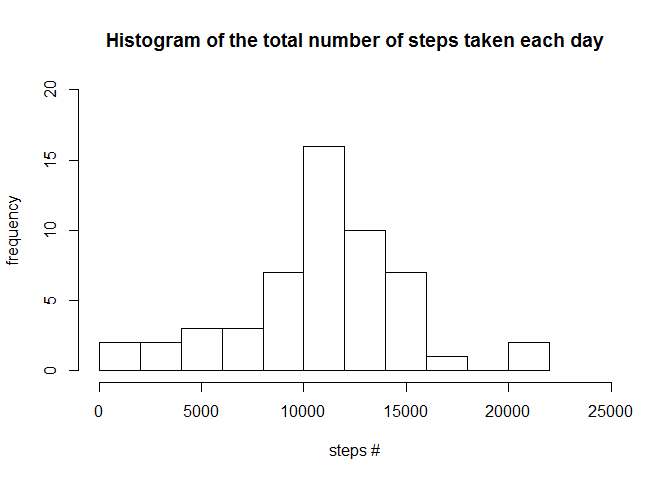
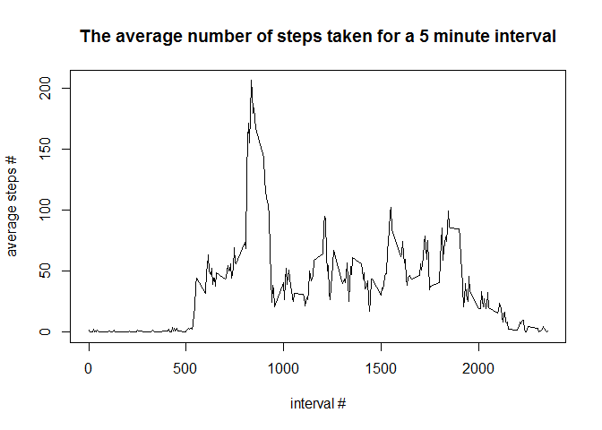
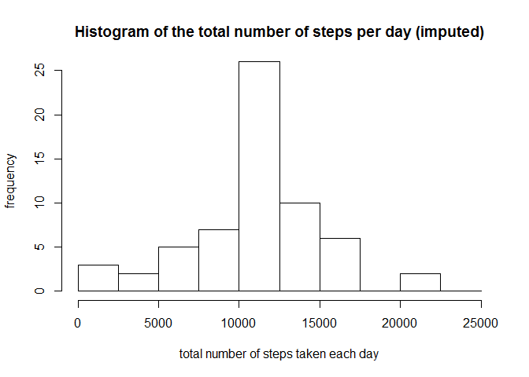

# Reproducible Research: Peer Assessment 1

## Introduction

This assignment makes use of data from a personal activity monitoring device. This device collects data at 5 minute intervals through out the day. The data consists of two months of data from an anonymous individual collected during the months of October and November, 2012 and include the number of steps taken in 5 minute intervals each day.

## Loading and preprocessing the data


```r
if(!file.exists("activity.zip")) {
        unzip("activity.zip")
}
data <- read.csv("activity.csv")
str(data)
```

```
## 'data.frame':	17568 obs. of  3 variables:
##  $ steps   : int  NA NA NA NA NA NA NA NA NA NA ...
##  $ date    : Factor w/ 61 levels "2012-10-01","2012-10-02",..: 1 1 1 1 1 1 1 1 1 1 ...
##  $ interval: int  0 5 10 15 20 25 30 35 40 45 ...
```

## What is the mean total number of steps taken per day?

1. Calculate the total number of steps taken per day

```r
stepsPerDay <- aggregate(steps ~ date, data, FUN = sum, na.rm = TRUE)
str(stepsPerDay)
```

```
## 'data.frame':	53 obs. of  2 variables:
##  $ date : Factor w/ 61 levels "2012-10-01","2012-10-02",..: 2 3 4 5 6 7 9 10 11 12 ...
##  $ steps: int  126 11352 12116 13294 15420 11015 12811 9900 10304 17382 ...
```

2. Make a histogram of the total number of steps taken each day

```r
hist(stepsPerDay$steps, freq = TRUE,
     main = paste("Histogram of the total number of steps taken each day"),
     xlab = "steps #", ylab = "frequency",
     axes = TRUE, plot = TRUE, xlim = c(0, 25000), ylim = c(0, 20), breaks = 8)
```

<!-- -->

3. Calculate and report the mean of the total number of steps taken per day:

```r
mean(stepsPerDay$steps, na.rm = TRUE)
```

```
## [1] 10766.19
```
Calculate and report the median of the total number of steps taken per day:

```r
median(stepsPerDay$steps, na.rm = TRUE)
```

```
## [1] 10765
```

## What is the average daily activity pattern?

1. Make a time series plot of the 5-minute interval and the average number of steps taken, averaged across all days

```r
stepsInIntervalAvg <- aggregate(steps ~ interval, data, FUN = mean, na.rm = TRUE)
plot(stepsInIntervalAvg$interval, stepsInIntervalAvg$steps, type = "l", 
     main = "The average number of steps taken for a 5 minute interval",
     xlab = "interval #", ylab = "average steps #")
```

<!-- -->

2. Which 5-minute interval, on average across all the days in the dataset, contains the maximum number of steps?

```r
stepsInIntervalAvg$interval[which.max(stepsInIntervalAvg$steps)]
```

```
## [1] 835
```

## Imputing missing values

1. Calculate and report the total number of missing values in the dataset

```r
indices <- which(is.na(data$steps))
length(indices) 
```

```
## [1] 2304
```

2. Devise a strategy for filling in all of the missing values in the dataset

I decided to fill in the missing values in the dataset using the mean of the 5-minute interval

3. Create a new dataset that is equal to the original dataset but with the missing data filled in

```r
dataFull <- data
for (i in indices) {
        ind <- which(stepsInIntervalAvg$interval == dataFull$interval[i])
        dataFull$steps[i] <- stepsInIntervalAvg$steps[ind]
}
str(dataFull)
```

```
## 'data.frame':	17568 obs. of  3 variables:
##  $ steps   : num  1.717 0.3396 0.1321 0.1509 0.0755 ...
##  $ date    : Factor w/ 61 levels "2012-10-01","2012-10-02",..: 1 1 1 1 1 1 1 1 1 1 ...
##  $ interval: int  0 5 10 15 20 25 30 35 40 45 ...
```

4. Make a histogram of the total number of steps taken each day

```r
stepsPerDayFull <- aggregate(steps ~ date, dataFull, FUN = sum, na.rm = TRUE)
hist(stepsPerDayFull$steps, freq = TRUE,
     main = paste("Histogram of the total number of steps per day (imputed)"),
     xlab = "total number of steps taken each day", ylab = "frequency",
     axes = TRUE, plot = TRUE, ylim = c(0, 25), breaks = seq(0,25000, by=2500))
```

<!-- -->

Calculate and report the mean total number of steps taken per day

```r
mean(stepsPerDayFull$steps, na.rm = TRUE)
```

```
## [1] 10766.19
```

Calculate and report the median total number of steps taken per day

```r
median(stepsPerDayFull$steps, na.rm = TRUE)
```

```
## [1] 10766.19
```

Do these values differ from the estimates from the first part of the assignment? What is the impact of imputing missing data on the estimates of the total daily number of steps?

The mean is the same before and after imputing, which makes sense bacause the missing values were filled in using the mean of the 5-minute interval, and since the missing values were only missing from full days, making the number of missing values equal for all intervals.

The median is slightly different after imputing, and is actually equal to the mean. It makes sense that the median moved closer to the mean, since I filled in the missing values using the mean values for each interval (and each interval had an equal number of NAs)

## Are there differences in activity patterns between weekdays and weekends?

1. Create a new factor variable in the dataset with two levels – “weekday” and “weekend” indicating whether a given date is a weekday or weekend day

```r
dataFull$weekpart <- factor(c("weekend", "weekday", "weekday", "weekday", "weekday", "weekday", "weekend")[as.POSIXlt(dataFull$date)$wday + 1])
str(dataFull)
```

```
## 'data.frame':	17568 obs. of  4 variables:
##  $ steps   : num  1.717 0.3396 0.1321 0.1509 0.0755 ...
##  $ date    : Factor w/ 61 levels "2012-10-01","2012-10-02",..: 1 1 1 1 1 1 1 1 1 1 ...
##  $ interval: int  0 5 10 15 20 25 30 35 40 45 ...
##  $ weekpart: Factor w/ 2 levels "weekday","weekend": 1 1 1 1 1 1 1 1 1 1 ...
```

2. Make a panel plot containing a time series plot of the 5-minute interval and the average number of steps taken, averaged across all weekday days or weekend days

```r
stepsInIntervalAvgWeekpart <- aggregate(steps ~ interval + weekpart, dataFull, FUN = mean, na.rm = TRUE)
library(lattice)
xyplot(steps ~ interval | weekpart, data = stepsInIntervalAvgWeekpart, layout = c(1, 2), type = "l")
```

<!-- -->
